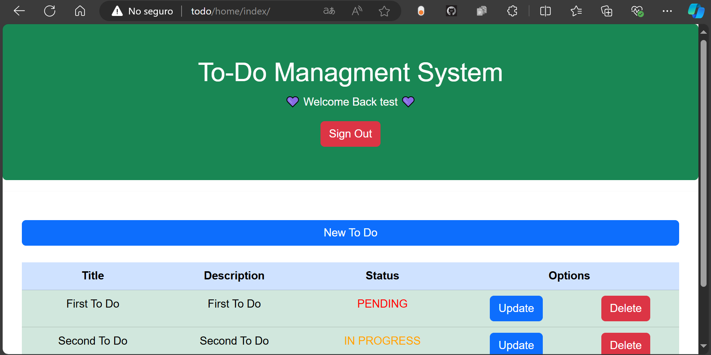

# ToDoManagement
A simple CRUD To Do List Management System, made with PHP, MySQL and a MVC approach

## Requirements
- PHP 8
- MySQL (I used version MariaDB 10.4.22, but any modern version should work)
- Apache Web Server (I used version 2.4, but any modern version should work)

**NOTE: I used a Windows environment for the build and testing of this project, particularly XAMPP was used as a Web Server solution stack.**

## Installation
1. Download/Clone the project
2. Put the project on the htdocs folder (Usually located at C:\xampp\htdocs)
3. Rename "htaccess" file to ".htaccess"
4. Open your MySQL management tool (In my case PHPMyAdmin)
5. Execute the .sql script located at models\database.sql
6. Lauch your Apache Server
7. Test on localhost (for example: http://localhost/ or http://localhost/ToDoManagement/)
8. If you have many projects on your htdocs folder, I'd recommend setting a VirtualHost, for example:
   - **On your C:\Windows\System32\drivers\etc\hosts file**
   > 127.0.0.1 todo
   
   - **On your C:\xampp\apache\conf\extra\httpd-vhosts.conf file**
   <VirtualHost *:80>
    DocumentRoot "C:/xampp/htdocs/to_do_list_management/"
    ServerName todo
	<Directory "C:/xampp/htdocs/to_do_list_management/">
       AllowOverride All
	   Require all granted
       Options Indexes FollowSymLinks
    </Directory>
</VirtualHost>
